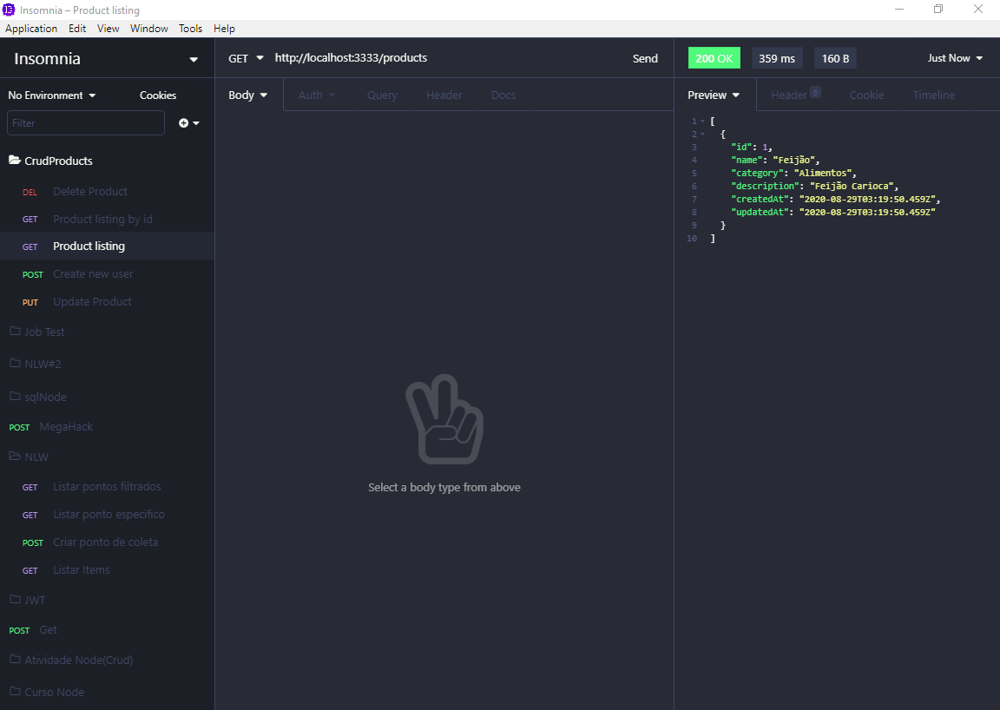

<h1 align="center">
    Crud De Produtos
</h1>

 
  O projeto é um crud de produtos utilizando NodeJS para o Server(Back-End), e postgres como banco de dados tendo apoio do sequelize para fazer as migrations, para rodar o banco pode-se utilizar docker ou postgres local sendo necessário configurar isso no arquivo "database.js" dentro da pasta "config".

## Requisições no insomnia

### Criação de Produtos 

    

### Listar Produtos 

    

### Listar Produto Pelo ID 

    

### Atualizar Dados do Produto 

    

### Deletar Produto 

    

## Funcionalidades

* Criar Produto;

* Listar Todos os Produtos;

* Listar Produto pelo ID;

* Atualizar dados de um Produto;

* Deletar Produto.

## Para rodar a aplicação

  * A primeira coisa é executar o comando yarn ou npm install,
  para instalar todas as dependencias necessárias para rodar o
  servidor.

  * Após a execução do comando yarn ou npm install efetue 
  "yarn sequelize db:create" para criar o banco de dados,
  logo em seguida "yarn sequelize db:migrate" para rodar as migrations.

  * Depois da criação do banco de dados e das tabelas, você pode usar
  "yarn start" para rodar o servidor, para realizar as requisições será
  necessário o uso do insomnia ou outra ferramenta parecida. 

## Tecnologias

  * NodeJS (Back-End);

  * Sequelize (ORM);

  * Postgres (Banco de dados);

  * Insomnia (Requisições).

